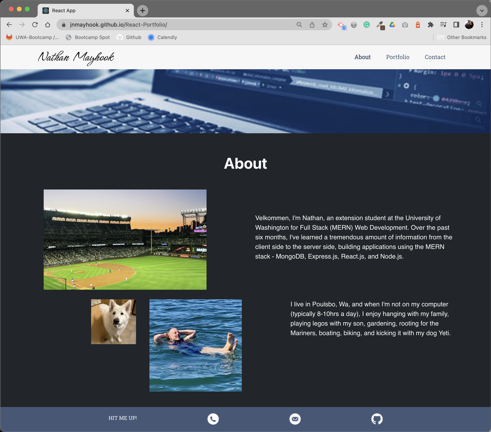

# React Portfolio

## Description
A responsive mobile-first version of my portfolio re-built using React.js.  Having just learned all about the React JavaScript library, one of the latest technologies for web development, and how it works, we put our skills to the test rebuliding our static HTML portfolios into a single page application.   

[Click here for the deployed app on GitHub pages.](https://jnmayhook.github.io/React-Portfolio/)

## Technologies
- React.js
- Bootstrap Framework

## Installation and Usage Instructions
Open the terminal and type `npm install` or `npm i` to install the dependencies.  Enter `npm start` to run the application.

## Screenshots

## Questions? 
Please contact me: 

GitHub: [@jnmayhook](https://github.com/jnmayhook)
Email: [jnmayhook@gmail.com](mailto:jnmayhook@gmail.com)

